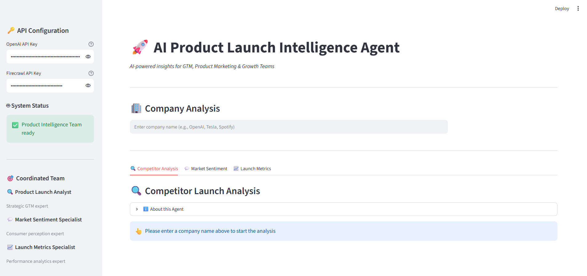
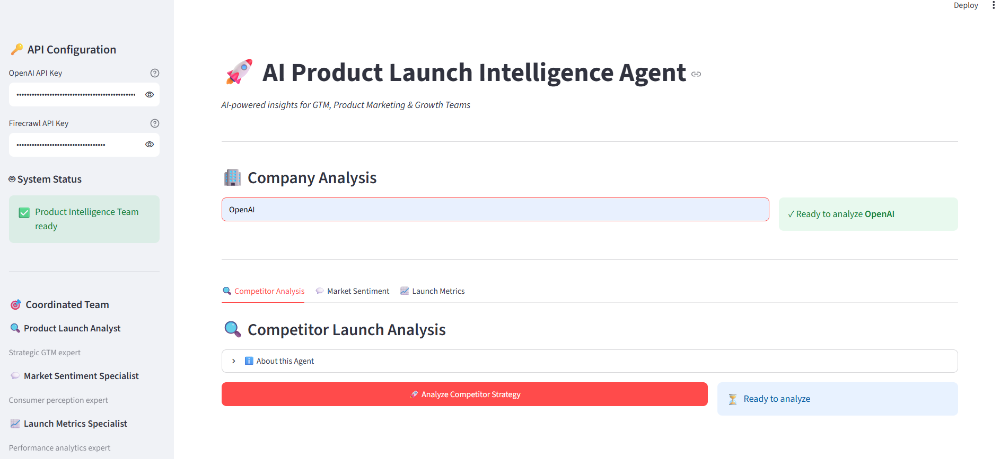

# AI Product Launch Intelligence Agent

An AI-powered product intelligence application designed to help Product Managers and Go-To-Market teams research competitors, understand market sentiment, and evaluate product launch signals from public web data.

The application uses a coordinated multi-agent architecture where specialized AI agents handle different aspects of product launch intelligence.

Built with **Python, Streamlit, Agno, OpenAI, and Firecrawl**.

## Key Capabilities

| Tab | What You Get |
|-----|--------------|
| **Competitor Analysis Agent** | Evidence-backed breakdown of a rival's latest launches – positioning, differentiators, pricing cues & channel mix |
| **Market Sentiment Agent** | Consolidated social chatter & review themes split by  *positive* /  *negative* drivers |
| **Launch Metrics Agent** | Publicly available KPIs – adoption numbers, press coverage, qualitative "buzz" signals |

## Features

- **Multi-agent architecture** — three specialized agents collaborate on product launch research
- **Competitor analysis** — analyzes competitive positioning, launches, pricing, and channels
- **Market sentiment analysis** — identifies positive and negative customer perception signals
- **Launch metrics analysis** — evaluates publicly available adoption and performance indicators
- **Interactive Streamlit UI** — simple workflow for entering a company, product, or hashtag
- **Structured reports** — generates concise findings followed by detailed analysis
- **Web research** — uses Firecrawl to gather relevant public web information

## Screenshots

### Main Dashboard



### Company Analysis



##  Tech Stack

| Layer | Technology |
|---|---|
| **Frontend** | Streamlit |
| **AI Agents** | Agno |
| **LLM** | OpenAI |
| **Web Research** | Firecrawl |
| **Language** | Python |

##  Quick Start

1. **Clone** the repository

```bash
git clone https://github.com/pushpitha-j/AI-Product-Launch-Intelligence.git
cd AI-Product-Launch-Intelligence
```

2. **Install** dependencies

```bash
pip install -r requirements.txt
```

3. **Provide API keys** (choose either option)

   • **Environment variables** – create a `.env` file:
   ```ini
   OPENAI_API_KEY=sk-************************
   FIRECRAWL_API_KEY=fc-************************
   ```
   • **In-app sidebar** – paste the keys into the secure text inputs

4. **Run the app**

```bash
streamlit run product_launch_intelligence_agent.py
```

5. **Browse** to <http://localhost:8501> – you should see three analysis tabs.

##  Using the Application

1. Enter **API keys** in the sidebar (or ensure they are in your environment).
2. Type a **company / product / hashtag** in the main input box.
3. Pick a tab and hit the corresponding **Analyze** button – a spinner will appear while the coordinated team works.
4. Review the two-part analysis:
   * Bullet list of key findings
   * Expanded, richly-formatted report (tables, call-outs, recommendations)

##  How the Coordinated Team Works

The application uses a **coordinated team approach** where three specialized agents work together:

- **Product Launch Analyst**: Evaluates competitive positioning, launch strategies, strengths, and weaknesses
- **Market Sentiment Specialist**: Analyzes social media sentiment, customer feedback, and brand perception  
- **Launch Metrics Specialist**: Tracks KPIs, adoption rates, press coverage, and performance indicators

The team coordinates based on the analysis type requested, ensuring the most appropriate agent handles each task while maintaining consistency and comprehensive coverage across all analysis types.
